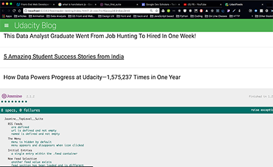

# Feed Reader Testing
##### Project for the *Front-End Web Developer Nanodegree*

#### Introduction

**Title**: Feed Reader

by Rebecca Hanlon

To run the test and see the results, open the project in your text editor.  Open the index.html files and then open in Chrome.  Scroll to the bottom of the page and you will see the test ran and the results.

Click [here](#pictures-of-passed-tests) to see screen shot of passing tests.

##### Technical Components
- Jasmine directory
    - lib / jasmine-2.1.2 / boot.js, console.js, jasmine.css, jsasmine.js, jasmine-html.js, jasmine-jquery.js, jasmine_favicon.png
    - spec / feedreader.js
- CSS and HTML
- JavaScript (ECMASript 6) and jQuery 3.3.1

##### Articles and Tutorials
**notes**:

While doing google searches trying to figure out the proper placement of the jasmine-jquery.js file, I found a more complex way to test *The Menu* using *spies* which focused on the click event.  I changed it after watching this tutorial because I liked the simpler more direct method of testing the click-event (and thanks to the article below the jquery matchers worked). I included the links for the articles on *spies* after this because they did influence my understanding of Jamsine and testing.

- FEND P5: Feed Reader Project-Walk Through with Alain [here](https://www.youtube.com/watch?v=pPt4oOKNdEk).
I wanted to view this video for help with the Async part of the testing and to hear further explanations for using Jasmine for testing.

- Stack overflow solution that referenced HTMLGoodies article above, explained how to handle DOM elements in Jasmine [here](https://stackoverflow.com/questions/48872864/testing-for-click-event-with-jasmine)

- An article *Testing DOM Events Using jQuery and Jasmine*,  from HTMLGoodies [here](https://www.htmlgoodies.com/beyond/javascript/js-ref/testing-dom-events-using-jquery-and-jasmine-2.0.html)
At first I couldn't get the jasmine-jquery.js file to load properly within the index.html file.  This article helped me fix that issue.

- Jasmine Docs [here](https://jasmine.github.io/tutorials/your_first_suite)

#### Pictures of Passed Tests

### Future Features
- At this time, my thoughts are not clear in which way I would go with expanding the app. I did find the Software Testing course and plan to study that course.

